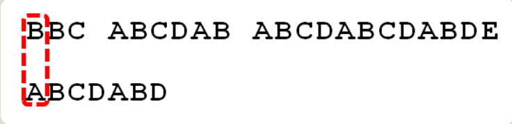
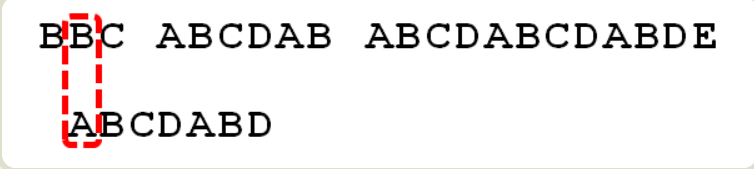
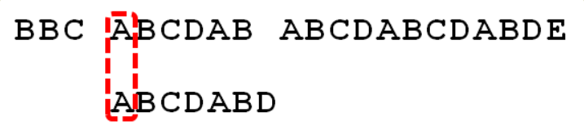
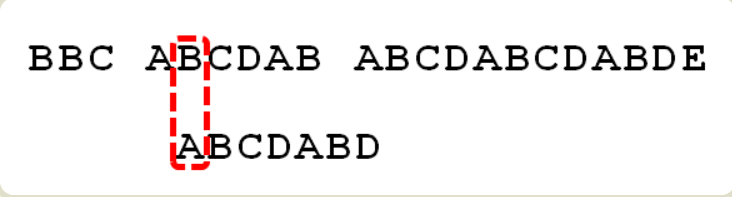
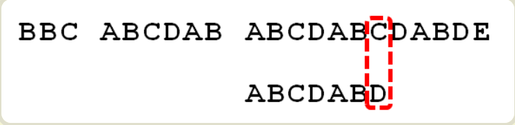
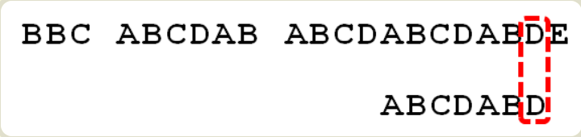
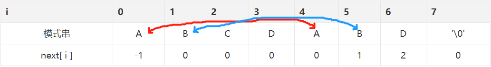

## KMP算法

有很多算法可以完成字符串匹配（字符串查找），Knuth-Morris-Pratt算法（简称KMP）是最常用的之一。它以三个发明者命名，起头的那个K就是著名科学家Donald Knuth。下面就参考网上博客加上自己的理解，来分析下KMP算法原理和实现。



首先，字符串"BBC ABCDAB ABCDABCDABDE"的第一个字符与搜索词"ABCDABD"的第一个字符，进行比较。因为B与A不匹配，所以搜索词后移一位。



因为B与A不匹配，搜索词再往后移。



就这样，直到字符串有一个字符，与搜索词的第一个字符相同为止。


接着比较字符串和搜索词的下一个字符，还是相同。


直到字符串有一个字符，与搜索词对应的字符不相同为止。



这时，最自然的反应是，将搜索词整个后移一位，再从头逐个比较。这样做虽然可行，但是效率很差，因为你要把"搜索位置"移到已经比较过的位置，重比一遍。**这就是字符串匹配的暴力解法。**


一个基本事实是，当空格与D不匹配时，你其实知道前面六个字符是"ABCDAB"。**KMP算法的想法是，设法利用这个已知信息，不要把"搜索位置"移回已经比较过的位置，继续把它向后移，这样就提高了效率。**

怎么做到这一点呢？可以针对搜索词，算出一张《部分匹配表》（Partial Match Table），该表记录的是已匹配字符串最长的相同真前后缀的长度。看到这里可能有点懵，别慌，继续往下看：


这张表是如何产生的，后面再介绍，这里只要会用就可以了。


已知空格与D不匹配时，前面六个字符"ABCDAB"是匹配的。查表可知，最后一个匹配字符B对应的"部分匹配值"为2，因此按照下面的公式算出向后移动的位数：`　移动位数 = 已匹配的字符数 - 对应的部分匹配值`，因为 6 - 2 等于4，所以将搜索词向后移动4位。


因为空格与Ｃ不匹配，搜索词还要继续往后移。这时，已匹配的字符数为2（"AB"），对应的"部分匹配值"为0。所以，移动位数 = 2 - 0，结果为 2，于是将搜索词向后移2位。


因为空格与A不匹配，继续后移一位。



逐位比较，直到发现C与D不匹配。于是，移动位数 = 6 - 2，继续将搜索词向后移动4位。



逐位比较，直到搜索词的最后一位，发现完全匹配，于是搜索完成。如果还要继续搜索（即找出全部匹配），移动位数 = 7 - 0，再将搜索词向后移动7位，这里就不再重复了。

### 前缀、后缀、匹配表

首先，要了解两个概念："前缀"和"后缀"。 "前缀"指除了最后一个字符以外，一个字符串的全部头部组合；"后缀"指除了第一个字符以外，一个字符串的全部尾部组合。


"部分匹配值"就是"前缀"和"后缀"的最长的共有元素的长度。以"ABCDABD"为例，


```
"A"的前缀和后缀都为空集，共有元素的长度为0；
"AB"的前缀为[A]，后缀为[B]，共有元素的长度为0；
"ABC"的前缀为[A, AB]，后缀为[BC, C]，共有元素的长度0；
"ABCD"的前缀为[A, AB, ABC]，后缀为[BCD, CD, D]，共有元素的长度为0；
"ABCDA"的前缀为[A, AB, ABC, ABCD]，后缀为[BCDA, CDA, DA, A]，共有元素为"A"，长度为1；
"ABCDAB"的前缀为[A, AB, ABC, ABCD, ABCDA]，后缀为[BCDAB, CDAB, DAB, AB, B]，共有元素为"AB"，长度为2；
"ABCDABD"的前缀为[A, AB, ABC, ABCD, ABCDA, ABCDAB]，后缀为[BCDABD, CDABD, DABD, ABD, BD, D]，共有元素的长度为0。
```


**"部分匹配"的实质是，有时候，字符串头部和尾部会有重复。比如，"ABCDAB"之中有两个"AB"，那么它的"部分匹配值"就是2（"AB"的长度）。搜索词移动的时候，第一个"AB"向后移动4位（字符串长度-部分匹配值），就可以来到第二个"AB"的位置。**

### kmp代码实现

kmp实现思路就是首先构造部分匹配表，这里我们称为next表；然后按照next表进行字符串查找操作。

#### next数组构建

next数组的构建基于*前缀*和*后缀*，即next[i]等于str.subString[0, i-1]最长的相同前后缀的长度（i=0时默认设置为-1）。换句话说，如果str中第j位的字符等于str中第next[i]位，则`next[j+1]=next[i]+1`，这里的j是当前遍历str的位置（后缀字符串中最后一位），i为上次匹配时的next数组中对应的值（前缀字符串中最后一位），i初始化-1。

比如字符串 **"ABCDABD"** 的next数组如下：



next数组构造代码如下：
```java
int[] next(String pattern) {
    int[] next = new int[pattern.length()];
    int i = -1; // 对应前缀字符串
    int j = 0;  // 对应后缀字符串

    next[0] = -1;
    while (j < pattern.length() - 1) {
        if (i == -1 || pattern.charAt(j) == pattern.charAt(i)) {
            next[++j] = ++i;
        } else {
            i = next[i];
        }
    }
    return next;
}
```

next数组完成构造之后，进行kmp查找就好理解多了，代码如下：
```java
int kmp(String str, String pattern) {
    int i = 0, j = 0;
    int[] next = next(pattern);
    while (i < str.length() && j < pattern.length()) {
        if (j == -1 || str.charAt(i) == pattern.charAt(j)) {
            i++;
            j++;
        } else {
            j = next[j];
        }
    }

    return j == pattern.length() ? i - j : -1;
}
```

> 参考资料：
1. [字符串匹配的KMP算法-阮一峰](http://www.ruanyifeng.com/blog/2013/05/Knuth%E2%80%93Morris%E2%80%93Pratt_algorithm.html)
2. [KMP算法（1）：如何理解KMP](https://segmentfault.com/a/1190000008575379)