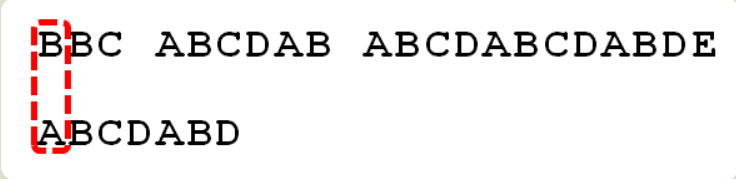
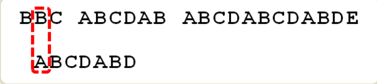
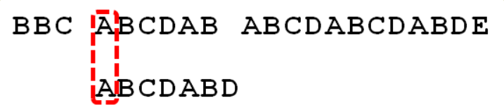
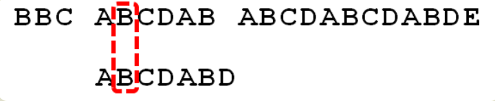
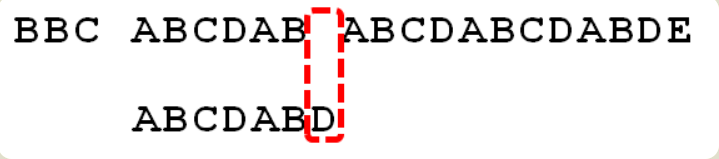
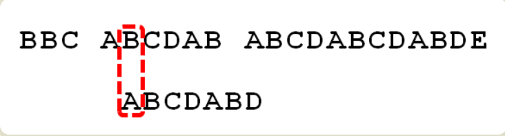
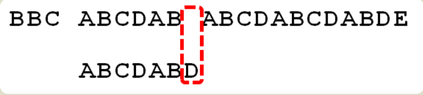

## KMP算法

有很多算法可以完成字符串匹配（字符串查找），有很多算法可以完成这一任务，Knuth-Morris-Pratt算法（简称KMP）是最常用的之一。它以三个发明者命名，起头的那个K就是著名科学家Donald Knuth。

首先，字符串"BBC ABCDAB ABCDABCDABDE"的第一个字符与搜索词"ABCDABD"的第一个字符，进行比较。因为B与A不匹配，所以搜索词后移一位。

因为B与A不匹配，搜索词再往后移。

就这样，直到字符串有一个字符，与搜索词的第一个字符相同为止。

接着比较字符串和搜索词的下一个字符，还是相同。

直到字符串有一个字符，与搜索词对应的字符不相同为止。

这时，最自然的反应是，将搜索词整个后移一位，再从头逐个比较。这样做虽然可行，但是效率很差，因为你要把"搜索位置"移到已经比较过的位置，重比一遍。**这就是字符串匹配的暴力解法。**

一个基本事实是，当空格与D不匹配时，你其实知道前面六个字符是"ABCDAB"。**KMP算法的想法是，设法利用这个已知信息，不要把"搜索位置"移回已经比较过的位置，继续把它向后移，这样就提高了效率。**

> 参考资料：
1. [字符串匹配的KMP算法-阮一峰](http://www.ruanyifeng.com/blog/2013/05/Knuth%E2%80%93Morris%E2%80%93Pratt_algorithm.html)
2. [KMP算法（1）：如何理解KMP](https://segmentfault.com/a/1190000008575379)